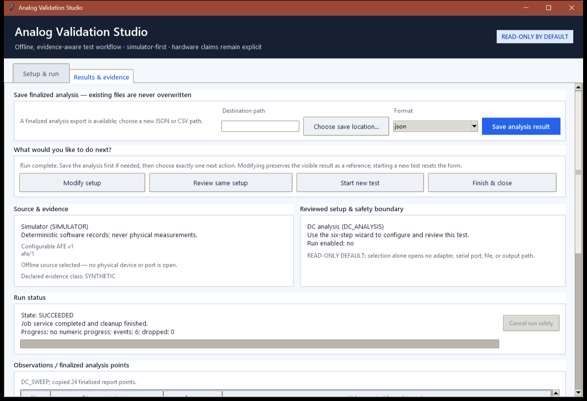
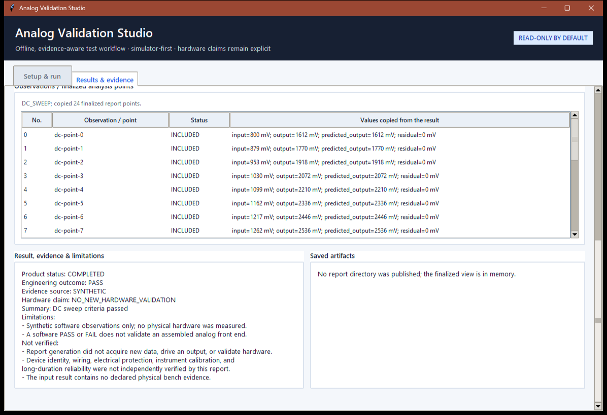

# Analog Validation Studio

> Controller-neutral software for repeatable analog front-end validation, automated test execution, and evidence-aware reporting.

**Private beta · Python 3.10+ · offline by default · hardware work deferred**

Analog Validation Studio is the software product inside the broader
**Configurable Analog Front-End & Validation Platform** project. It turns
Simulator, CSV Replay, and explicitly selected receive-only serial data into
reviewed acquisition jobs, engineering analyses, and traceable reports. The
design keeps device profiles replaceable so the product is not tied to one
microcontroller or laboratory.

> **Evidence boundary:** the screenshots and demo below use deterministic
> `SYNTHETIC` data. No configurable AFE has been built or bench-validated, so
> this repository makes zero AFE hardware-performance claims. A prior
> `BENCH_CONTROLLER` record validates only a narrow, receive-only MSP430 UART
> compatibility path; it does not validate the future AFE, sensors, wiring, or
> instruments.

## Product at a glance

| Area | Current state |
|---|---|
| Product version | `mixed-signal-afe-validation-platform 0.1.0b1` |
| Delivery stage | Software Phase 6 release engineering — 7/8 checkpoints |
| Interfaces | Installed CLI, local Tk Dashboard, JSON/CSV exports, text/Markdown/HTML/SVG reports |
| Data sources | Deterministic Simulator, strict CSV Replay, receive-only serial profiles |
| Analyses | DC gain/offset/linearity with saturation exclusion; directional hysteresis; calibration and offline frequency response |
| Extension model | Public `DeviceAdapter` and serial-profile contracts |
| Latest local quality run | 2,275 tests passed; 11,911/11,911 package statements covered |
| Latest committed PR #7 CI | Eight hosted jobs passed on Windows/Ubuntu and Python 3.10/3.12/3.14 |
| Hardware claim | `NO_NEW_HARDWARE_VALIDATION` — physical AFE not built or measured |

[Detailed status](docs/PROJECT_STATUS.md) ·
[Milestone/resume handoff](reports/PROJECT_MILESTONE_RESUME_HANDOFF_2026-09-03.md) ·
[Installation](docs/INSTALLATION.md) ·
[Tester guide](docs/USER_TESTING_GUIDE.md) ·
[Changelog](CHANGELOG.md)

## Product preview

The local Dashboard makes the six-step Source → Test → Configure → Review →
Run → Result workflow visible. It does not open a file, port, or output merely
because a source is selected.

The result view separates product completion from engineering outcome and
shows provenance, excluded points, limitations, and the explicit hardware
claim. Both images were captured from the current Windows application using
the Simulator; see the [media evidence register](media/README.md).

## Why this project exists

Analog validation often becomes a collection of one-off scripts, board-specific
commands, manually edited spreadsheets, and ambiguous screenshots. This project
builds a reusable product boundary around that work:

- **Repeatability:** immutable requests, deterministic Simulator data, strict
  replay files, fixed CRC vectors, and versioned schemas.
- **Safety:** review-before-run, capability and range preflight, bounded jobs,
  cooperative cancellation, cleanup-before-conclusion, and receive-only serial
  product paths.
- **Evidence integrity:** `SYNTHETIC`, `CSV_REPLAY`, `HOST_TEST`,
  `BENCH_CONTROLLER`, and future bench evidence remain distinguishable.
- **Extensibility:** adapters and profiles isolate controllers, instruments,
  transports, and future hardware from analysis and presentation code.
- **Auditability:** reports preserve criteria, metrics, point disposition,
  lineage, limitations, versions, and SHA-256 identities without recalculating
  a finalized conclusion.

## What is implemented

| Product layer | Implemented capability |
|---|---|
| Domain and protocol | Immutable measurements/capabilities/test runs; bounded ASCII framing; CRC-16/CCITT-FALSE; AFE v1 and MSP430 Equipment Health v1 receive-only parsing |
| Sources and adapters | Deterministic Simulator, immutable CSV Replay, bounded serial lifecycle, public adapter/profile contracts |
| Test execution | Shared read workflow; safety-gated DC and hysteresis runners; bounded single-owner worker |
| Analysis | Unit normalization, saturation/quality exclusion, OLS gain/offset/R²/RMSE, hysteresis thresholds/width, calibration, offline frequency response |
| Product surfaces | Installed `analog-validation` CLI, guided Dashboard, deterministic demo, structured exports, human-readable reports |
| Release engineering | Hosted matrix CI, compatibility manifests, reproducible wheel/sdist checks, isolated base/serial installs, privacy and evidence audits |

Full feature-level evidence is maintained in
[Project Status](docs/PROJECT_STATUS.md) and
[Requirements Traceability](docs/REQUIREMENTS_TRACEABILITY.md).

Not yet complete: calibration/frequency-response `TestRun` export mappings,
real-time runner deadlines, long-duration physical transport testing, a
validated configurable AFE, reference-controller output hardware, and v1.0
publication.

## 60-second software demo

Requirements: Python 3.10 or later. The primary verified development
environment uses Python 3.12.

~~~powershell
git clone https://github.com/Carlos-0798/mixed-signal-afe-validation-platform.git
cd mixed-signal-afe-validation-platform
python -m venv .venv
.\.venv\Scripts\python.exe -m pip install -e .
.\.venv\Scripts\analog-validation.exe demo --output .\work\portfolio-demo
.\.venv\Scripts\analog-validation.exe dashboard
~~~

The demo executes the reviewed 24-point synthetic DC product chain and creates
12 deterministic machine, replay, report, chart, and manifest artifacts in a
new directory. It requires no serial driver, physical device, network service,
or laboratory instrument.

For development:

~~~powershell
.\.venv\Scripts\python.exe -m pip install -e ".[dev]"
.\.venv\Scripts\python.exe -m pytest
.\.venv\Scripts\ruff.exe check .
.\.venv\Scripts\mypy.exe src tools tests examples
~~~

Optional serial support is isolated behind `.[serial]` and remains receive-only
at the product boundary. Read [pyserial and physical-port safety](docs/pyserial-backend.md)
before selecting a real port.

## Architecture

~~~mermaid
flowchart LR
    Sources["Simulator · CSV Replay · receive-only Serial · future instruments"]
    Adapters["Public adapters and versioned profiles"]
    Core["Measurements · capabilities · reviewed requests"]
    Execution["Worker · workflows · safety-gated runners"]
    Analysis["DC · hysteresis · calibration · frequency response"]
    Evidence["JSON/CSV · text/MD/HTML/SVG · Dashboard"]

    Sources --> Adapters --> Core --> Execution --> Analysis --> Evidence
    AFE["Future configurable AFE"] -. electrical/protocol contract .-> Sources
    MSP["Independent MSP430 product"] -. public compatibility profile .-> Adapters
~~~

The analysis layer never depends on a COM name, board register, SDK call, or
pin map. The Dashboard presents finalized data and does not own CRC, fitting,
saturation exclusion, threshold calculation, or PASS/FAIL logic.

[Architecture](docs/PRODUCT_ARCHITECTURE.md) ·
[Architecture decisions](docs/adr/README.md) ·
[Public adapter example](docs/PUBLIC_ADAPTER_EXAMPLE.md) ·
[Phase 5 public contract](docs/phase5-public-api.md)

## Source and compatibility matrix

| Source/profile | Product operation | Evidence | Current boundary |
|---|---|---|---|
| Simulator / `afe/1` | Read, synthetic DC, synthetic hysteresis | `SYNTHETIC` | Default, deterministic, no hardware |
| CSV Replay | Read, DC, hysteresis | `CSV_REPLAY` | Strict local file; historical source is not promoted |
| AFE v1 serial | Receive-only observations | Depends on declared capture | Protocol/profile host-tested; future physical AFE not validated |
| MSP430 Equipment Health v1 | Receive-only observations | `HOST_TEST` or narrow `BENCH_CONTROLLER` capture | Independent peer product; no command encoder or write surface |
| Third-party adapter | Shared public read workflow | Adapter-declared and checked | Demonstrated from an installed wheel using only public API |
| Future instruments/controllers | Planned adapter/profile | Future explicit bench class | Requires safety review and separate evidence |

The MSP430 Equipment Health Controller and this project are independent
products. They are not intended to merge, and neither is part of the OSU Lab
Bench Monitor Senior Capstone.

## Verification and claim discipline

| Gate | Verified result |
|---|---|
| Local software gate | 2,275 passed; 100% statement coverage across 11,911 package statements; Ruff and mypy passed |
| Hosted PR #7 gate | Eight jobs green at committed head `8f7eaf6`; the newer local UX follow-up is not yet pushed |
| Reproducible candidate baseline | Local/hosted four-file `0.1.0b1` candidate matched byte-for-byte at audited commit `f6721b5` |
| Release audit | `PASS_WITH_REVIEW`; zero current-tree privacy findings, eight legacy-history review items, zero high-confidence credentials |
| Dashboard validation | Simulator/CSV interaction, data entry, adaptive scrolling, fresh save paths, navigation, cancellation, first-paint, and keyboard/scaling checks |
| Physical controller evidence | One prior five-frame receive-only MSP430 UART capture with zero application writes; exact firmware and peripherals unverified |
| Physical AFE evidence | Not run |

These rows do not imply 100% branch coverage, production readiness, electrical
safety certification, or validated AFE performance. Historical checkpoint
reports retain the exact counts and evidence available when they were written.

[Executed reports](reports/README.md) ·
[Step 7 release audit](reports/software-phase6-step7.md) ·
[Windows Dashboard QA](reports/dashboard-ux-windows-qa-2026-09-02.md) ·
[Known limitations](docs/KNOWN_LIMITATIONS.md)

## Roadmap

| Stage | Status | Exit condition |
|---|---|---|
| Software Phases 0–5 | Complete | Core, adapters, analyses, CLI/Dashboard/reports/demo, compatibility freeze |
| Software Phase 6 | 7/8 | Owner-reviewed UX follow-up, hosted CI, publication decisions, controlled release |
| Hardware design preparation | Deferred | Confirmed requirements, tools, instruments, components, safety review |
| Breadboard AFE | Not started | Power/protection/buffer/gain/filter/Schmitt tests with raw bench evidence |
| Automated hardware validation | Not started | Replaceable reference controller/instrument adapters and repeatable datasets |
| PCB/productization | Not started | Bench-stable design, schematic/PCB reviews, bring-up and reliability evidence |

No hardware purchasing or construction is required to evaluate the current
software product.

## Repository map

~~~text
src/analog_validation/      controller-neutral domain, protocol, adapters, analysis
src/analog_validation_app/  product services, CLI, Dashboard, reports, worker
tests/                      unit, golden, integration, architecture, product gates
test-data/golden/           frozen compatibility vectors and exact results
examples/public_adapter/    external public-API-only extension example
docs/                       product, protocol, safety, user, and architecture guides
reports/                    executed checkpoints with evidence limitations
simulation/                 LTspice tasks and ideal-model evidence
hardware/                   deferred design and procurement planning
media/                      classified software visuals; future bench media is separate
~~~

## Documentation

- Start here: [Installation](docs/INSTALLATION.md),
  [CLI](docs/product-cli.md), [Dashboard](docs/dashboard.md),
  [software demo](docs/software-demo.md), and
  [beginner testing](docs/USER_TESTING_GUIDE.md).
- Engineering: [Theory](docs/theory.md),
  [protocol](docs/protocol.md), [CRC/framing](docs/framing-and-crc.md),
  [DC analysis](docs/dc-sweep-analysis.md),
  [hysteresis](docs/hysteresis-analysis-and-runner.md), and
  [result exports](docs/result-exports.md).
- Product governance: [Project status](docs/PROJECT_STATUS.md),
  [product plan](docs/PRODUCT_PLAN.md),
  [requirements traceability](docs/REQUIREMENTS_TRACEABILITY.md),
  [security policy](SECURITY.md), [contributing](CONTRIBUTING.md), and
  [publication checklist](docs/PUBLICATION_CHECKLIST.md).
- Portfolio handoff: [GitHub and LinkedIn copy preview](docs/PORTFOLIO_COPY.md)
  with an explicit claims gate and owner-approval sequence.

## Safety, privacy, and publication

- The default product path is offline and Simulator-first.
- Serial is opt-in, explicitly configured, and receive-only at the application
  boundary; operating-system drivers may still affect control lines.
- Existing result files are never overwritten by default.
- Reports, screenshots, and release manifests must retain provenance and
  limitation labels.
- Publication requires a separate owner decision for repository visibility,
  Git-history review, license, release/tag, social preview, and LinkedIn copy.

See [Security](SECURITY.md), [publication checklist](docs/PUBLICATION_CHECKLIST.md),
[assumptions](ASSUMPTIONS.md), [test/evidence policy](docs/test-plan.md), and
[risk register](docs/risk-register.md).

## License

No open-source license has been selected. All rights are currently reserved by
the project owner. Public visibility, if later chosen, would make the source
viewable but would not itself grant permission to reuse, modify, or distribute
it.
