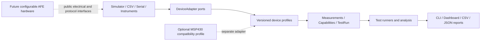

# Configurable Analog Front-End & Validation Platform

> **Analog Validation Studio** — a controller-neutral software and future low-voltage hardware platform for repeatable analog front-end characterization, automated test execution, and evidence-aware reporting.

| Project status | Current value |
|---|---|
| Development stage | Software Phase 3 in progress — 4/8 checkpoints complete |
| Release maturity | Pre-MVP; safety-gated host DC runner implemented |
| Current package | `mixed-signal-afe-validation-platform 0.1.0.dev0` |
| Automated host tests | 906 passed |
| Formal package coverage | 100% of 3,352 statements |
| Highest evidence level | `HOST_TEST` |
| Verified hardware claims | **0 — hardware has not been built or bench-validated** |

[Detailed project status](docs/PROJECT_STATUS.md) · [Phase 3 plan](docs/SOFTWARE_PHASE_3_PLAN.md) · [DC runner](docs/dc-sweep-runner.md) · [Step 4 report](reports/software-phase3-step4.md)

## Product vision

The project is being developed as an independent, reusable product rather than an accessory for one microcontroller board. Its long-term goal is to combine:

- a configurable low-voltage analog front end;
- controller-neutral Python test automation;
- replaceable simulator, file-replay, serial-controller, and instrument adapters;
- DC sweep, gain, offset, saturation, hysteresis, calibration, and frequency-response workflows;
- provenance-aware data and reports that distinguish synthetic, simulated, and physical evidence.

The software-first plan allows the complete software product to mature without requiring school laboratory equipment. Physical hardware becomes a later adapter and device-under-test path rather than a dependency of the software architecture.

## What is implemented today

- Installable `src/analog_validation` Python package with a single version source.
- Stable validation, framing, CRC, capability, configuration, and protocol error families.
- Immutable Measurement, TestRun, safe-range, and DeviceCapabilities models.
- Explicit evidence sources and quality flags; synthetic data cannot silently become bench evidence.
- Single CRC-16/CCITT-FALSE implementation with fixed golden vectors.
- Strict printable-ASCII CSV framing with CRC and a 128-byte record limit.
- Versioned `AFE,1,...` profile for telemetry, commands, and multi-record capability exchange.
- AFE v1 mapping into controller-neutral Measurement and DeviceCapabilities models.
- Host-side command checks that distinguish unsupported capability from unsafe configuration.
- Strict `validation-config.v1` JSON with profile, channel, unit, timeout, provenance, and layered output-safety validation.
- Frozen AFE v1 compatibility contract: 20 valid wire/model records and 9 rejected error cases.
- Deterministic 100-frame synthetic telemetry pipeline producing 400 explicitly `SYNTHETIC` Measurements.
- Executable architecture check that keeps serial, GUI, board SDKs, `dashboard`, and tools outside the formal core.
- Controller-neutral `DeviceAdapter` contract with explicit disconnected, read-only, capability-confirmed, armed, running, and safe-shutdown states.
- Host-side adapter gates that reject premature I/O, unsafe output, capability mismatches, wrong units, and evidence-source mismatches.
- Reusable eight-check read-only adapter contract passed by the reference fixture, Simulator, and CSV Replay implementations.
- Deterministic read-only `SimulatorAdapter` with versioned gain, offset, noise, saturation, hysteresis, and controlled-fault configuration.
- Independent analog-input, analog-output, and threshold-state streams with stable timestamps and explicit `SYNTHETIC` provenance.
- Saturation and missing-data quality flags plus stable communication and CRC fault exceptions.
- Immutable `csv-replay.v1` dataset/record models with strict version, UTC time, unit, status, declared-source, quality, identity, ordering, and END-count validation.
- Bounded read-only CSV parsing with stable replay format/version/limit errors and frozen valid/invalid compatibility data.
- Versioned read-only `CsvReplayAdapter` with explicit channel roles/ranges, independent per-channel cursors, immediate or scaled timing, runtime speed control, pause/resume, and typed EOF.
- Replayed Measurements preserve timestamps, values, units, status, quality, and original record references while forcing current provenance to `CSV_REPLAY`.
- Versioned, immutable shared read-workflow requests/results used unchanged by Simulator and CSV Replay.
- Atomic capability preflight: missing commands, channels, or units return explicit `UNSUPPORTED` before any record is consumed.
- Explicit `COMPLETED`, `UNSUPPORTED`, and `INCOMPLETE` acquisition states; completion never masquerades as an engineering test PASS.
- Workflow-owned connect/capability/read/disconnect lifecycle with cleanup on expected EOF and execution errors.
- Frozen Phase 2 public API manifest covering exports, schema versions, enums, signature shapes, error inheritance, and replay-file hashes.
- Frozen end-to-end Simulator, CSV Replay, and atomic `UNSUPPORTED` workflow meaning.
- Versioned `analysis-common.v1` foundation with immutable record lineage, one-source measurement batches, explicit included/excluded/invalid dispositions, and exact quality-derived exclusion reasons.
- Default-deny suspect-quality policy: selected finite suspect flags require an explicit immutable allowlist; missing/non-finite and invalid records cannot be promoted.
- Strict finite V/mV normalization that does not guess units and never changes evidence provenance.
- Versioned provenance-aware DC sweep analysis with traceable input/output pairing, configurable inclusive saturation exclusion, exact incomplete-data gaps, and retained per-point decisions.
- Ordinary least-squares gain/offset, R², RMSE, maximum absolute residual, plus prediction/residual values for every included point in a complete fit.
- Immutable versioned DC acceptance criteria for gain, absolute offset, R², RMSE, and included-point count, with one explicit result record per rule.
- Evidence-safe TestRun mapping: complete evaluations become PASS/FAIL; missing criteria, incomplete analysis, or insufficient evidence points remain INCOMPLETE.
- Versioned controller-neutral DC sweep plans, acquisition-step lineage, and runner results in a separate `analog_validation.runners` namespace.
- Default-deny runner preflight for permission, profile, source, command, channel, unit, every setpoint range, and `SAFE_SHUTDOWN` before any write or read.
- Injected settle/abort callbacks, ordered repetitions, partial-evidence preservation, and safe `UNSUPPORTED`/`INCOMPLETE`/`ERROR` degradation.
- Host-test reference output execution plus integration proof that the read-only Simulator and CSV Replay adapters remain `UNSUPPORTED` with zero acquisition.
- One formal AFE telemetry generator shared by the Simulator foundation, legacy CLI wrapper, and frozen 100-frame regression.
- Reproducible pytest, coverage, Ruff, mypy, sdist, and wheel verification gates.

Not yet implemented: formal hysteresis runner, calibration/frequency analysis, structured result exports, serial transport, product CLI, dashboard, end-user reports, firmware, real-time runner deadlines, or validated physical hardware.

## Architecture



The analysis and reporting layers must not depend on COM port names, board registers, SDK calls, or board-specific pin maps. A new controller should require a profile/adapter, not a rewrite of the core product.

See the [Device adapter contract](docs/adapters.md) for the lifecycle and host-side safety boundary.

## AFE v1 example

AFE v1 records use the common bounded framing and an explicit profile version:

```text
AFE,1,TEL,120,45120,0,500,2487,4974,1,0000,D312
AFE,1,CMD,5,SET,STIMULUS_MV,0,1650,AD30
AFE,1,CAP_REQ,77,00F6
```

Capability responses use a DEVICE record, one CHANNEL record per advertised channel, and an END record. This avoids exceeding the 128-byte framing limit as devices grow.

See [AFE v1 profile](docs/afe-v1-profile.md), [CRC and framing](docs/framing-and-crc.md), [safe configuration](docs/configuration.md), and [protocol reference](docs/protocol.md).

## Verification snapshot

The current results are host-software evidence only:

| Verification gate | Result |
|---|---|
| Full pytest suite | 906 passed |
| Formal package statement coverage | 100% of 3,352 statements |
| Phase 3 common analysis semantics | 56 focused tests; 244/244 statements covered |
| Phase 3 DC sweep analysis | 81 focused tests; 325/325 statements covered |
| Phase 3 DC criteria and TestRun mapping | 67 focused tests; 201/201 statements covered |
| Phase 3 safety-gated DC runner | 58 focused tests; 348/348 module statements covered |
| DeviceAdapter lifecycle and safety tests | 36 passed |
| Reusable concrete-adapter contract | 8 shared checks passed by reference, Simulator, and CSV Replay adapters |
| Simulator-specific unit tests | 69 passed |
| CSV Replay parser tests | 84 unit + 9 golden cases passed |
| CSV Replay adapter tests | 45 focused unit + 8 shared-contract checks passed |
| Shared read workflow | 25 unit + 8 Simulator/CSV integration checks passed |
| Phase 2 public API/workflow golden compatibility | 11 checks passed |
| AFE v1 profile tests | 40 passed |
| AFE golden compatibility | 20 valid + 9 invalid records passed |
| Deterministic synthetic integration | 100 frames / 400 Measurements passed |
| Ruff | Passed on the full repository |
| mypy | Passed on 78 source files |
| Latest isolated build, sdist, and external wheel public-API smoke checks | Passed |
| Hardware bench tests | Not run |

Every completed software checkpoint has a report under [`reports/`](reports/). Test counts and claims are updated only after the corresponding command has actually run.

## Quick start

Requirements: Python 3.10 or later. The current verified development environment uses Python 3.12.

```powershell
python -m venv .venv
.\.venv\Scripts\python.exe -m pip install -e ".[dev]"
.\.venv\Scripts\python.exe -m pytest
.\.venv\Scripts\python.exe -c "import analog_validation; print(analog_validation.__version__)"
```

Minimal AFE v1 round trip:

```python
from analog_validation.protocol import AfeTelemetry, encode_afe_message, parse_afe_message

message = AfeTelemetry(
    seq=1,
    time_ms=100,
    channel=0,
    input_mv=500,
    output_mv=1000,
    gain_milli=2000,
    threshold=0,
    fault_flags=0,
)

record = encode_afe_message(message)
assert parse_afe_message(record) == message
```

Load the safe read-only configuration example:

```python
from analog_validation import load_validation_config

config = load_validation_config(
    "examples/config/afe-synthetic-readonly.v1.json"
)
assert config.allow_output is False
```

Read three deterministic synthetic measurements through the product adapter:

```python
from analog_validation import SimulatorAdapter, SimulatorConfig

adapter = SimulatorAdapter(SimulatorConfig(seed=430, interval_ms=10))
adapter.connect()
capabilities = adapter.get_capabilities()
measurements = [
    adapter.read_measurement("afe.ch0.input")
    for _ in range(3)
]
adapter.disconnect()

assert capabilities.is_read_only
assert [item.value for item in measurements] == [800.0, 879.0, 953.0]
assert all(item.source.value == "SYNTHETIC" for item in measurements)
```

## Roadmap

| Stage | Purpose | Status |
|---|---|---|
| Software Phase 0 | Product baseline, audit, requirements, architecture decisions | Complete |
| Software Phase 1 | Domain, protocol, configuration, and golden core | Complete — 8/8 checkpoints |
| Software Phase 2 | DeviceAdapter, simulator, CSV replay, capability workflow | Complete — 8/8 checkpoints |
| Software Phase 3 | Test runners, analysis, calibration, structured results | In progress — 4/8 checkpoints |
| Software Phase 4 | Serial transport and independent controller profiles | Planned |
| Software Phase 5 | CLI, dashboard, and evidence-aware reports | Planned |
| Software Phase 6 | Packaging, CI, documentation, and v1.0 release | Planned |
| Hardware Phases 0–7 | Design freeze through PCB and MSP430 compatibility | Gated; not started |

Software Phase 3 Step 4 is complete: the controller-neutral DC runner now preflights every output/read/safe-shutdown requirement, executes ordered setpoints and repetitions, preserves partial evidence, cleans up every owned lifecycle, and only evaluates PASS/FAIL after successful cleanup. Step 5 will add formal directional hysteresis analysis and a runner that reuses the same safety principles. Real hardware remains later work.

## Repository guide

```text
src/analog_validation/    installable controller-neutral product core
dashboard/                legacy analysis/UI placeholders awaiting later phases
tools/                    repository-local synthetic data and developer utilities
tests/                    unit, golden, integration, architecture, and legacy-analysis regression tests
test-data/golden/         frozen compatibility vectors
docs/                     product, architecture, protocol, safety, and status
reports/                  executed validation records and evidence limits
simulation/               LTspice tasks and ideal-model evidence
hardware/                 deferred design and procurement planning
```

## Independence and integration boundary

This is an **independent personal engineering project**.

- The configurable AFE and Analog Validation Studio are the product.
- MSP430FR6989 support is a future compatibility profile, not the product identity or required controller.
- Other controllers can integrate through documented 3.3 V electrical interfaces and versioned public protocols.
- This repository is separate from the **OSU Lab Bench Monitor Senior Capstone** and does not contain or claim team capstone output.

## Safety and evidence policy

- Only low-voltage 0–3.3 V work is planned; mains experimentation is out of scope.
- Numeric ranges in software fixtures are examples, not validated hardware limits.
- `SYNTHETIC`, `SPICE_*`, and `HOST_TEST` evidence cannot support physical performance claims.
- Only documented `BENCH_*` records may support future hardware claims.
- No external output may be enabled until device capability, safe range, common ground, wiring, and shutdown behavior are confirmed.

See [assumptions requiring confirmation](ASSUMPTIONS.md), [test and evidence policy](docs/test-plan.md), and [risk register](docs/risk-register.md).

## Documentation

- [Beginner project guide](docs/BEGINNER_PROJECT_GUIDE.md)
- [Product plan and staged acceptance gates](docs/PRODUCT_PLAN.md)
- [Product architecture](docs/PRODUCT_ARCHITECTURE.md)
- [AFE v1 profile](docs/afe-v1-profile.md)
- [CSV Replay v1 format](docs/csv-replay-v1.md)
- [Shared read workflow](docs/read-workflow.md)
- [DC sweep analysis](docs/dc-sweep-analysis.md)
- [DC criteria and TestRun mapping](docs/dc-sweep-criteria.md)
- [Safety-gated DC sweep runner](docs/dc-sweep-runner.md)
- [Frozen Phase 2 public API](docs/phase2-public-api.md)
- [Versioned safe configuration](docs/configuration.md)
- [Capability and TestRun semantics](docs/capabilities-and-test-runs.md)
- [Theory calculations](docs/theory.md)
- [Development environment](docs/DEVELOPMENT_ENVIRONMENT.md)

## License

No open-source license has been selected. All rights are currently reserved by the project owner.
