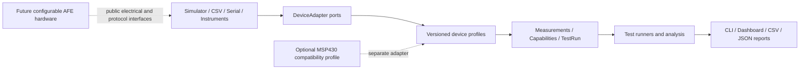

# Configurable Analog Front-End & Validation Platform

> **Analog Validation Studio** — a controller-neutral software and future low-voltage hardware platform for repeatable analog front-end characterization, automated test execution, and evidence-aware reporting.

| Project status | Current value |
|---|---|
| Development stage | Software Phase 6 release engineering — 7/8 checkpoints |
| Release maturity | Audited private beta candidate ready for owner review; no tag or Release published |
| Current package | `mixed-signal-afe-validation-platform 0.1.0b1` |
| Automated tests | 2,252 passed in the latest full local quality run |
| Formal + optional + product package coverage | 100% of 11,470 statements |
| Highest evidence level | `BENCH_CONTROLLER` — MSP430 UART compatibility only |
| Verified AFE hardware performance claims | **0 — the AFE has not been built or bench-validated** |

[Detailed project status](docs/PROJECT_STATUS.md) · [Phase 6 plan](docs/SOFTWARE_PHASE_6_PLAN.md) · [Private-beta installation](docs/INSTALLATION.md) · [Tester guide](docs/USER_TESTING_GUIDE.md) · [Private-beta handoff](docs/PRIVATE_BETA_HANDOFF.md) · [Draft release notes](docs/RELEASE_NOTES_DRAFT.md) · [Step 7 audit](reports/software-phase6-step7.md) · [Public adapter example](docs/PUBLIC_ADAPTER_EXAMPLE.md) · [Changelog](CHANGELOG.md) · [CLI guide](docs/product-cli.md) · [Dashboard guide](docs/dashboard.md) · [Phase 5 compatibility contract](docs/phase5-public-api.md)

## Product vision

The project is being developed as an independent, reusable product rather than an accessory for one microcontroller board. Its long-term goal is to combine:

- a configurable low-voltage analog front end;
- controller-neutral Python test automation;
- replaceable simulator, file-replay, serial-controller, and instrument adapters;
- DC sweep, gain, offset, saturation, hysteresis, calibration, and frequency-response workflows;
- provenance-aware data and reports that distinguish synthetic, simulated, and physical evidence.

The software-first plan allows the complete software product to mature without requiring school laboratory equipment. Physical hardware becomes a later adapter and device-under-test path rather than a dependency of the software architecture.

The separate MSP430 Equipment Health Controller is a peer product, not a subordinate component and not a future merge target. Each product remains independently usable, versioned, tested, documented, and presented. Compatibility is implemented only through public, versioned profiles and adapters.

## What is implemented today

- Installable `src/analog_validation` Python package with a single version source.
- Stable validation, framing, CRC, capability, configuration, and protocol error families.
- Immutable Measurement, TestRun, safe-range, and DeviceCapabilities models.
- Explicit evidence sources and quality flags; synthetic data cannot silently become bench evidence.
- Single CRC-16/CCITT-FALSE implementation with fixed golden vectors.
- Profile-neutral printable-ASCII token/CRC envelope with configurable bounded record size.
- Backward-compatible AFE framing wrapper preserving the frozen `Frame`, encode/decode, error, and byte contracts.
- Explicit `afe-channel-map.v1` conversion between historical telemetry names and canonical Simulator/workflow names without silently rewriting old records.
- Versioned `AFE,1,...` profile for telemetry, commands, and multi-record capability exchange.
- AFE v1 mapping into controller-neutral Measurement and DeviceCapabilities models.
- Host-side command checks that distinguish unsupported capability from unsafe configuration.
- Strict `validation-config.v1` JSON with profile, channel, unit, timeout, provenance, and layered output-safety validation.
- Frozen AFE v1 compatibility contract: 20 valid wire/model records and 9 rejected error cases.
- Deterministic 100-frame synthetic telemetry pipeline producing 400 explicitly `SYNTHETIC` Measurements.
- Executable architecture check that keeps serial, GUI, board SDKs, `dashboard`, and tools outside the formal core.
- Controller-neutral `DeviceAdapter` contract with explicit disconnected, read-only, capability-confirmed, armed, running, and safe-shutdown states.
- Host-side adapter gates that reject premature I/O, unsafe output, capability mismatches, wrong units, and evidence-source mismatches.
- Reusable eight-check read-only adapter contract passed by the reference fixture, Simulator, and CSV Replay implementations.
- Deterministic read-only `SimulatorAdapter` with versioned gain, offset, noise, saturation, hysteresis, and controlled-fault configuration.
- Independent analog-input, analog-output, and threshold-state streams with stable timestamps and explicit `SYNTHETIC` provenance.
- Saturation and missing-data quality flags plus stable communication and CRC fault exceptions.
- Immutable `csv-replay.v1` dataset/record models with strict version, UTC time, unit, status, declared-source, quality, identity, ordering, and END-count validation.
- Bounded read-only CSV parsing with stable replay format/version/limit errors and frozen valid/invalid compatibility data.
- Versioned read-only `CsvReplayAdapter` with explicit channel roles/ranges, independent per-channel cursors, immediate or scaled timing, runtime speed control, pause/resume, and typed EOF.
- Replayed Measurements preserve timestamps, values, units, status, quality, and original record references while forcing current provenance to `CSV_REPLAY`.
- Versioned, immutable shared read-workflow requests/results used unchanged by Simulator and CSV Replay.
- Atomic capability preflight: missing commands, channels, or units return explicit `UNSUPPORTED` before any record is consumed.
- Explicit `COMPLETED`, `UNSUPPORTED`, and `INCOMPLETE` acquisition states; completion never masquerades as an engineering test PASS.
- Workflow-owned connect/capability/read/disconnect lifecycle with cleanup on expected EOF and execution errors.
- Frozen Phase 2 public API manifest covering exports, schema versions, enums, signature shapes, error inheritance, and replay-file hashes.
- Frozen end-to-end Simulator, CSV Replay, and atomic `UNSUPPORTED` workflow meaning.
- Versioned `analysis-common.v1` foundation with immutable record lineage, one-source measurement batches, explicit included/excluded/invalid dispositions, and exact quality-derived exclusion reasons.
- Default-deny suspect-quality policy: selected finite suspect flags require an explicit immutable allowlist; missing/non-finite and invalid records cannot be promoted.
- Strict finite V/mV normalization that does not guess units and never changes evidence provenance.
- Versioned provenance-aware DC sweep analysis with traceable input/output pairing, configurable inclusive saturation exclusion, exact incomplete-data gaps, and retained per-point decisions.
- Ordinary least-squares gain/offset, R², RMSE, maximum absolute residual, plus prediction/residual values for every included point in a complete fit.
- Immutable versioned DC acceptance criteria for gain, absolute offset, R², RMSE, and included-point count, with one explicit result record per rule.
- Evidence-safe TestRun mapping: complete evaluations become PASS/FAIL; missing criteria, incomplete analysis, or insufficient evidence points remain INCOMPLETE.
- Versioned controller-neutral DC sweep plans, acquisition-step lineage, and runner results in a separate `analog_validation.runners` namespace.
- Default-deny runner preflight for permission, profile, source, command, channel, unit, every setpoint range, and `SAFE_SHUTDOWN` before any write or read.
- Injected settle/abort callbacks, ordered repetitions, partial-evidence preservation, and safe `UNSUPPORTED`/`INCOMPLETE`/`ERROR` degradation.
- Host-test reference output execution plus integration proof that the read-only Simulator and CSV Replay adapters remain `UNSUPPORTED` with zero acquisition.
- Versioned directional hysteresis analysis with strict rising/falling order, exact 0/1 state, four-record transition lineage, midpoint interval estimates, and no partial thresholds.
- Per-cycle high/low/width plus repeated-cycle summary statistics; reverse transitions, chatter, multiple transitions, and `high < low` are explicitly rejected.
- Versioned hysteresis criteria and a safety-gated repeated rising/falling runner with cleanup-before-conclusion semantics.
- Immutable versioned linear calibration fitting with separate observed/reference provenance, before/after error metrics, and coefficient input lineage.
- Calibration application creates new Measurements, preserves source/raw record identity, and never overwrites the input batch.
- Offline frequency-response analysis accepts explicit Hz/input/output amplitude points, normalizes V/mV, calculates ratio and dB, and uses documented dB-versus-log-frequency cutoff interpolation.
- Missing/invalid points suppress conclusions; zero or negative amplitudes, non-increasing frequency, and ambiguous multiple cutoff crossings are rejected explicitly.
- Immutable `result-export.v1` bundles that preserve TestRun metadata, criteria, metrics, point decisions, source schemas, evidence lineage, and mandatory limitations.
- Typed DC sweep and hysteresis export builders that copy finalized results without recomputing metrics, thresholds, or PASS/FAIL.
- Deterministic strict JSON plus four-column row-oriented CSV with exact round trips, finite-number enforcement, version/size/row bounds, and typed errors.
- Atomic UTF-8 result-file publication with existing destinations protected by default and replacement allowed only through explicit `overwrite=True`.
- Frozen Phase 3 compatibility manifest covering public exports, 12 schemas, stable constants, 8 enum sets, key call signatures, result-export error bases, and golden-file hashes.
- Exact synthetic DC and hysteresis golden results that protect numerical meaning, point lineage, saturation exclusion, criteria, provenance, and deterministic JSON output.
- One formal AFE telemetry generator shared by the Simulator foundation, legacy CLI wrapper, and frozen 100-frame regression.
- Reproducible pytest, coverage, Ruff, mypy, sdist, and wheel verification gates.
- Profile-neutral bounded LF byte-stream recovery for fragmented, coalesced, exact-limit, overlong, damaged, and disconnect-reset input.
- Profile-configurable 2–64-bit sequence tracking with explicit first/in-order/gap/duplicate/out-of-order results and tested 16/32-bit wrap behavior.
- Mixed-profile fragmented-stream integration from the bounded byte framer into the neutral CRC envelope, with frozen AFE-shaped and MSP430-shaped host fixtures.
- Replaceable `SerialBackend` port and immutable connection settings without a runtime pyserial, OS-driver, controller, or COM dependency.
- Deterministic `SerialSession` discovery/open/bounded-read/timeout/disconnect/finite-reconnect/close lifecycle with partial-frame reset and stable typed errors.
- Bounded memory-only raw-record provenance with exact bytes, UTC receive time, logical port, explicit profile, monotonic ID, parse/error outcome, and optional sequence observation.
- Explicit `PENDING_PROFILE`, `PARSED`, and `REJECTED` states so receiving data never silently becomes validated data.
- Count/byte/metadata limits, FIFO eviction counters, privacy notice, and no automatic raw persistence or upload.
- Test-only failure-injecting memory backend plus a composite serial→framer→raw→CRC→sequence→outcome host proof.
- Public `serial-profile.v1` extension point with explicit identity, typed accepted/rejected results, reset diagnostics, and one-way dependency enforcement.
- Independent `AfeV1SerialProfile` that maps exact raw records through the frozen AFE decoder, 16-bit telemetry continuity, canonical Measurement channels, strict capability aggregation, and bounded raw outcomes.
- All 20 valid and 9 invalid historical AFE golden records pass through the new serial-profile path without changing their exact bytes or error contracts.
- Independent read-only `Msp430HealthV1SerialProfile` derived from the peer product's frozen public UART Protocol v1 interface, with no peer runtime import or command encoder.
- Strict typed parsing for device-output `TEL`, `ACK`, `STS`, `CFG`, and `LOG`, plus 32-bit TEL continuity and `4294967295 -> 0` wrap handling.
- Sentinel/fault-aware mapping that keeps `-32768` temperatures and INA219-fault zeros unavailable while preserving every raw field, power value, state, and fault bit for audit.
- Repository-owned MSP430 interoperability fixtures: 10 valid and 11 invalid cases covering all output families, CRC, fields, unknown state, sentinel/fault semantics, limits, and raw rejection.
- Static MSP430 capabilities advertise only `READ_MEASUREMENT`, no output channels, and no `SAFE_SHUTDOWN`; fan PWM is read-only telemetry rather than AFE stimulus.
- Receive-only `SerialAdapter` composition for an explicitly selected `SerialSession` and `SerialProfile`, with bounded polling/buffering and no backend write or generic command escape hatch.
- Explicit AFE capability aliases from `adcN/dacN/pwmN/dinN` to `afe.chN.input/dac/pwm/threshold`, while retaining the native capability snapshot for audit and stripping every output-affecting command.
- The same eight-check `DeviceAdapter` contract passes for both AFE and MSP430 serial configurations; the shared `ReadWorkflow` consumes both without profile-specific branching.
- Reconnect invalidates capabilities and buffered Measurements until they are reconfirmed; CRC/framing rejects remain traceable raw events and never become Measurements.
- Read-only MSP430 serial integration returns `UNSUPPORTED` with zero writes for both DC-sweep and hysteresis output runners.
- Optional `analog_validation_pyserial` integration with lazy dependency loading, privacy-minimal COM discovery, exact line-setting mapping, bounded reads, deterministic close, and no public `write()` method.
- Repository-owned `msp430-receive-only-hil.v1` capture that runs the physical MSP430 UART through `SerialAdapter` and `ReadWorkflow`, retains raw/CRC/sequence/fault evidence locally, and refuses to overwrite prior captures.
- Accepted receive-only COM4 result: 5/5 CRC-valid TEL records, continuous sequence/uptime, 25 `BENCH_CONTROLLER` Measurements, zero unexpected records, zero disconnects, and zero application writes/bytes; exact firmware and every external peripheral remain unverified.
- Frozen Phase 4 compatibility manifest covering 121 exports in seven namespaces, three schemas, 12 enum/flag sets, 21 public call shapes, 17 error relationships, stable profile identities, and five fixture hashes.
- Exact AFE/MSP430 external-backend composite results that preserve 16/32-bit wrap, CRC rejection, canonical mapping, unavailable sentinels, raw lineage, `HOST_TEST` provenance, deterministic close, and absence of a write surface.
- Installable `analog_validation_app` product layer with immutable, bounded `product-job.v1` and `product-result.v1` contracts that cannot request output or promote incomplete/cancelled work into an engineering conclusion.
- Reviewed `product-catalog.v1` entries for Simulator, CSV Replay, AFE v1, and independent MSP430 Equipment Health v1 receive-only compatibility, with exact profile matching and no identity guessing.
- Stable `user-issue.v1` mapping that separates expected user-facing failures from hidden internal details and always provides what happened, a possible cause, and a safe next step.
- One installed `analog-validation` entry point with deterministic human/JSON version, profile, Simulator, CSV Replay, and explicit receive-only serial workflows; the base wheel runs without pyserial or a display.
- Product dependency tests that preserve one-way `analog_validation_app -> analog_validation` composition and reject copied protocol/analysis implementations; the superseded Phase 0 `dashboard/` source and legacy-only analysis tests have been retired.
- Bounded single-owner `ProductJobWorker` with immutable monotonic events, cooperative cancellation, finite join timeouts, result/issue capture, and deterministic service cleanup.
- Host fault/race coverage for duplicate starts, startup/run/cleanup failures, cancellation during startup/run/completion, queue eviction, close timeouts, and thread-start failure without importing device, analysis, serial, or GUI implementations.
- Explicit product factories and shared read/DC/hysteresis services that compose the frozen adapters, workflow, analysis, criteria, and export APIs without copying engineering logic.
- Stable `simulate read/dc/hysteresis` and `replay read/dc/hysteresis` commands, structured artifact hashes, default no-overwrite, and distinct worker/product/engineering status.
- Discovery-only `ports` plus bounded `observe` with exact port/profile/channel and read-only confirmation; memory-backend integration proves zero writes without opening a physical port.
- Stable CLI exit codes 0/1/2/3/4/5/70/130, safe default traceback suppression, and a subprocess interpreter-interrupt regression that confirms cancellation and cleanup.
- Immutable `human-report.v1` presentation views that copy finalized result bundles without importing analysis, adapters, serial, GUI, or network code.
- Deterministic plain-text, Markdown, self-contained HTML, and SVG reports for DC and hysteresis, with visible evidence, limitations, not-verified items, versions, record lineage, and canonical input hash.
- Atomic create-new five-file report publication and exact DC/hysteresis golden hashes; HTML contains inline CSS and the exact generated SVG but no scripts or remote resources.
- Installed `analog-validation report` support for strict JSON/CSV result exports with stable user issues and exit codes that preserve the finalized engineering outcome.
- Immutable `dashboard-state.v1` panels and explicit actions, plus an owner-thread presenter that copies reviewed catalog selections, bounded worker events, structured issues, finalized product results, report points, and path-free artifact identities.
- A headless Dashboard controller that polls the existing single-owner worker, maps cooperative cancel/close into bounded cleanup, and never creates adapters or jobs itself.
- A lazy local Tkinter/ttk six-region shell for Source/Profile, Configuration/Safe Review, Progress, Plot/Point Table, Result/Evidence, and Artifacts; every state and evidence class is expressed in text rather than color alone.
- A fixed six-step beginner workflow for source, test, configuration, review, Run, and result/export, with what/why/confirm guidance and visible acceptance criteria.
- Shared CLI/Dashboard `product-workflow-config.v1` compilation, so both entry points use the same reviewed request, source factory, worker service, core analysis, criteria, and export path.
- Stable `analog-validation dashboard` behavior with Simulator default, Replay preflight, explicit bounded receive-only Serial configuration, cooperative cancel, create-new JSON/CSV export, lazy Tk import, and no network listener.
- A one-command `analog-validation demo` that runs the reviewed 24-point synthetic DC product chain and publishes 12 byte-reproducible machine, replay, report, chart, and manifest artifacts.
- Product-quality acceptance for 10,000-record Replay parsing, a bounded 10,000-event worker burst, keyboard focus, Windows Tk scaling, Unicode paths, fail-closed output, privacy, and offline operation.
- Frozen Phase 5 product compatibility covering four public namespaces, 14 schemas, 10 enum sets, 36 dataclass contracts, 35 public signatures, 24 error relationships, 25 issue mappings, 16 CLI paths, eight exit codes, 13 serialized field groups, and six golden hashes.
- Release-style repository-external base and `[serial]` wheel installations; the base product remains driver-independent, while the serial smoke uses an injected host substitute without enumerating or opening a real port.
- A create-new release verifier that requires a clean Git commit, repeats isolated wheel/sdist builds, normalizes non-content sdist metadata, compares exact bytes, runs fresh base and `[serial]` installs, reproduces the demo in normal/Unicode paths, and emits `release-candidate-manifest.v1` only after every gate passes.

Not yet implemented: calibration/frequency TestRun export mappings, firmware, real-time runner deadlines, long-duration physical transport testing through this product, the guided tester documentation/bundle, the final candidate audit, or validated physical AFE hardware.

## Architecture



The analysis and reporting layers must not depend on COM port names, board registers, SDK calls, or board-specific pin maps. A new controller should require a profile/adapter, not a rewrite of the core product.

See the [Device adapter contract](docs/adapters.md) for the lifecycle and host-side safety boundary.

## AFE v1 example

AFE v1 records use the common bounded framing and an explicit profile version:

```text
AFE,1,TEL,120,45120,0,500,2487,4974,1,0000,D312
AFE,1,CMD,5,SET,STIMULUS_MV,0,1650,AD30
AFE,1,CAP_REQ,77,00F6
```

Capability responses use a DEVICE record, one CHANNEL record per advertised channel, and an END record. This avoids exceeding the 128-byte framing limit as devices grow.

See [AFE v1 profile](docs/afe-v1-profile.md), [CRC and framing](docs/framing-and-crc.md), [safe configuration](docs/configuration.md), and [protocol reference](docs/protocol.md).

The read-only MSP430 profile parses the peer product's device-output records
without exposing its command surface:

```text
TEL,1,1000,-32768,-32768,0,0,0,0,FAULT,0015,80FC
STS,42,9000,AUTO,0,NORMAL,0000,7836
```

The first record means four mapped sensor/electrical values are unavailable;
it is not a measurement of `-3276.8 degC` or true zero voltage/current. See
[serial profiles](docs/serial-profiles.md) for the exact mapping and evidence
boundary.

## Verification snapshot

Most verification rows below are host-software evidence. The one physical UART
row is separately limited to the Step 7 five-record `BENCH_CONTROLLER` capture.

| Verification gate | Result |
|---|---|
| Full pytest suite | 2,252 passed in the latest full local quality run |
| Formal + optional + product package statement coverage | 100% of 11,470 statements |
| Phase 5 Step 8 product compatibility | 15 new checks; 154 total golden checks; public imports/schemas/call shapes, CLI/options/exits, serialized fields, errors/issues, and exact prior manifests frozen |
| Phase 5 Step 7 demo and product quality | 186 focused tests; two installed demos in normal/Unicode paths were byte-identical; 10,000-record/event bounded acceptance and real Tk scaling/focus smoke passed |
| Phase 4 public API and composite golden compatibility | 13 checks; 121 exports, 3 schemas, 12 enum/flag sets, 21 signatures, 17 errors, 5 fixture hashes, and exact AFE/MSP external-backend results frozen |
| Phase 4 optional pyserial backend and receive-only HIL | 127/127 optional statements covered; base and `[serial]` external installs passed; COM4 delivered 5/5 valid continuous TEL, 25 Measurements, and zero writes; exact firmware unconfirmed |
| Phase 4 receive-only SerialAdapter and product chains | 74 new tests; 282/282 added statements covered; AFE/MSP shared contracts, workflows, reconnect, and zero-write runner degradation passed |
| Phase 4 MSP430 Equipment Health v1 profile | 121 new tests; 416/416 new-module statements covered; 10 valid + 11 invalid independent fixtures |
| Phase 4 AFE v1 serial profile | 59 new tests; 225/225 added statements covered; 20 valid + 9 invalid golden cases retained |
| Phase 4 driver-neutral serial lifecycle/raw events | 88 new tests; 428/428 added statements covered |
| Phase 4 bounded stream and sequence foundation | 32 focused tests; 158/158 statements covered |
| Phase 4 neutral envelope and channel mapping | 51 new tests; envelope/mapping/framing 176/176 statements covered |
| Phase 3 common analysis semantics | 56 focused tests; 244/244 statements covered |
| Phase 3 DC sweep analysis | 81 focused tests; 325/325 statements covered |
| Phase 3 DC criteria and TestRun mapping | 67 focused tests; 201/201 statements covered |
| Phase 3 safety-gated DC runner | 58 focused tests; 348/348 module statements covered |
| Phase 3 hysteresis analysis, criteria, and runner | 38 focused tests; 892/892 new module statements covered |
| Phase 3 calibration and offline frequency response | 48 focused tests; 705/705 new module statements covered |
| Phase 3 versioned JSON/CSV result exports | 43 focused tests; 640/640 export statements covered |
| Phase 3 public API and exact-result golden compatibility | 12 checks passed |
| DeviceAdapter lifecycle and safety tests | 36 passed |
| Reusable concrete-adapter contract | 8 shared checks passed by reference, Simulator, CSV Replay, AFE SerialAdapter, and MSP430 SerialAdapter configurations |
| Simulator-specific unit tests | 69 passed |
| CSV Replay parser tests | 84 unit + 9 golden cases passed |
| CSV Replay adapter tests | 45 focused unit + 8 shared-contract checks passed |
| Shared read workflow | 25 unit + 8 Simulator/CSV integration checks passed |
| Phase 2 public API/workflow golden compatibility | 11 checks passed |
| AFE v1 profile tests | 40 passed |
| AFE golden compatibility | 20 valid + 9 invalid records passed |
| Deterministic synthetic integration | 100 frames / 400 Measurements passed |
| Ruff | Passed on the full repository |
| mypy | Passed on 204 source/tool/test/example files |
| Latest deterministic candidate | Local and hosted Windows/Python 3.12 produced a byte-identical four-file `0.1.0b1` bundle from commit `f6721b5`; `release-audit.v1` reports `PASS_WITH_REVIEW`, private binary beta `READY`, 0 current privacy findings, 8 legacy history review items, 0 high-confidence credentials, and `NO_NEW_HARDWARE_VALIDATION` |
| Physical controller UART | Passed with limitations — receive-only Protocol v1 compatibility only; see Step 7 report |
| AFE hardware bench tests | Not run |

Every completed software checkpoint has a report under [`reports/`](reports/). Test counts and claims are updated only after the corresponding command has actually run.

## Quick start

Requirements: Python 3.10 or later. The current verified development environment uses Python 3.12.

```powershell
python -m venv .venv
.\.venv\Scripts\python.exe -m pip install -e ".[dev]"
.\.venv\Scripts\python.exe -m pytest
.\.venv\Scripts\analog-validation.exe --help
.\.venv\Scripts\analog-validation.exe version
.\.venv\Scripts\analog-validation.exe profiles
.\.venv\Scripts\analog-validation.exe simulate read --samples 3
.\.venv\Scripts\analog-validation.exe simulate dc --points 12 --json
.\.venv\Scripts\analog-validation.exe simulate hysteresis
.\.venv\Scripts\analog-validation.exe demo --output .\analog-validation-demo
.\.venv\Scripts\analog-validation.exe dashboard
```

The three Simulator workflows and the demo run real product services and formal
software analysis, but use only deterministic synthetic observations. The
Dashboard uses the same reviewed services through its six-step workflow; its
default run is still software-only. A software PASS, generated report, or opened
window is not a physical AFE result. See the
[CLI guide](docs/product-cli.md) for Replay, exports, exit codes, cancellation,
and the explicit serial safety gate.

Add optional real-port support only when a serial controller is needed:

```powershell
.\.venv\Scripts\python.exe -m pip install -e ".[dev,serial]"
```

The owner-approved passive MSP430 command requires an explicit port, sends no
application bytes, and writes create-new evidence below ignored `work/`:

```powershell
.\.venv\Scripts\python.exe -m tools.msp430_read_only_hil --port COM4 --frames 5
```

See [optional pyserial and HIL safety](docs/pyserial-backend.md) before using a
physical port.

Minimal AFE v1 round trip:

```python
from analog_validation.protocol import AfeTelemetry, encode_afe_message, parse_afe_message

message = AfeTelemetry(
    seq=1,
    time_ms=100,
    channel=0,
    input_mv=500,
    output_mv=1000,
    gain_milli=2000,
    threshold=0,
    fault_flags=0,
)

record = encode_afe_message(message)
assert parse_afe_message(record) == message
```

Load the safe read-only configuration example:

```python
from analog_validation import load_validation_config

config = load_validation_config(
    "examples/config/afe-synthetic-readonly.v1.json"
)
assert config.allow_output is False
```

Read three deterministic synthetic measurements through the product adapter:

```python
from analog_validation import SimulatorAdapter, SimulatorConfig

adapter = SimulatorAdapter(SimulatorConfig(seed=430, interval_ms=10))
adapter.connect()
capabilities = adapter.get_capabilities()
measurements = [
    adapter.read_measurement("afe.ch0.input")
    for _ in range(3)
]
adapter.disconnect()

assert capabilities.is_read_only
assert [item.value for item in measurements] == [800.0, 879.0, 953.0]
assert all(item.source.value == "SYNTHETIC" for item in measurements)
```

## Roadmap

| Stage | Purpose | Status |
|---|---|---|
| Software Phase 0 | Product baseline, audit, requirements, architecture decisions | Complete |
| Software Phase 1 | Domain, protocol, configuration, and golden core | Complete — 8/8 checkpoints |
| Software Phase 2 | DeviceAdapter, simulator, CSV replay, capability workflow | Complete — 8/8 checkpoints |
| Software Phase 3 | Test runners, analysis, calibration, structured results | Complete — 8/8 checkpoints |
| Software Phase 4 | Serial transport and independent controller profiles | Complete — 8/8 checkpoints |
| Software Phase 5 | CLI, dashboard, demo, evidence-aware reports, and compatibility freeze | Complete — 8/8 checkpoints; Software Beta |
| Software Phase 6 | Packaging, CI, documentation, and v1.0 preparation | In progress — 7/8 checkpoints |
| Hardware Phases 0–7 | Design freeze through PCB and MSP430 compatibility | Gated; not started |

Software Phases 1–5 are complete. Phase 6 Steps 1–7 have frozen the release contract, established read-only hosted CI across Windows/Ubuntu and Python 3.10/3.12/3.14, aligned the private-beta metadata at `0.1.0b1`, added a deterministic create-new candidate verifier, completed a beginner tester workflow, proved a public-API-only external read adapter against the installed wheel, and completed the candidate/current-tree/full-history/license/workbook/claims audit. The private binary beta is ready for controlled testing; public-history remediation, licensing, merge/tag/Release, and v1.0 remain owner decisions. The earlier Phase 4 Step 7 physical result remains a separate narrow controller-UART claim, and all real AFE hardware work remains gated.

## Repository guide

```text
src/analog_validation/    installable controller-neutral product core
src/analog_validation_app/ product contracts, services, reports, Dashboard, worker, and CLI entry point
tools/                    repository-local synthetic data and developer utilities
tests/                    unit, golden, integration, and architecture regression tests
test-data/golden/         frozen compatibility vectors
examples/public_adapter/  public-only third-party-style read-only extension example
docs/                     product, architecture, protocol, safety, and status
reports/                  executed validation records and evidence limits
simulation/               LTspice tasks and ideal-model evidence
hardware/                 deferred design and procurement planning
```

## Independence and integration boundary

This is an **independent personal engineering project**.

- The configurable AFE and Analog Validation Studio are the product.
- MSP430FR6989 support is a host-tested optional compatibility profile, not the product identity or required controller.
- Other controllers can integrate through documented 3.3 V electrical interfaces and versioned public protocols.
- This repository is separate from the **OSU Lab Bench Monitor Senior Capstone** and does not contain or claim team capstone output.

## Safety and evidence policy

- Current release boundary: `NO_NEW_HARDWARE_VALIDATION`.
- Only low-voltage 0–3.3 V work is planned; mains experimentation is out of scope.
- Numeric ranges in software fixtures are examples, not validated hardware limits.
- `SYNTHETIC`, `SPICE_*`, and `HOST_TEST` evidence cannot support physical performance claims.
- Only documented `BENCH_*` records may support future hardware claims.
- No external output may be enabled until device capability, safe range, common ground, wiring, and shutdown behavior are confirmed.

See [assumptions requiring confirmation](ASSUMPTIONS.md), [test and evidence policy](docs/test-plan.md), and [risk register](docs/risk-register.md).

## Documentation

- [Beginner project guide](docs/BEGINNER_PROJECT_GUIDE.md)
- [Product plan and staged acceptance gates](docs/PRODUCT_PLAN.md)
- [Product architecture](docs/PRODUCT_ARCHITECTURE.md)
- [AFE v1 profile](docs/afe-v1-profile.md)
- [AFE channel naming mapping v1](docs/afe-channel-mapping.md)
- [Serial lifecycle and raw-event boundary](docs/serial-transport.md)
- [Serial profiles and AFE v1 integration](docs/serial-profiles.md)
- [Optional pyserial backend and receive-only HIL](docs/pyserial-backend.md)
- [CSV Replay v1 format](docs/csv-replay-v1.md)
- [Shared read workflow](docs/read-workflow.md)
- [DC sweep analysis](docs/dc-sweep-analysis.md)
- [DC criteria and TestRun mapping](docs/dc-sweep-criteria.md)
- [Safety-gated DC sweep runner](docs/dc-sweep-runner.md)
- [Calibration and offline frequency response](docs/calibration-and-frequency-response.md)
- [Versioned JSON/CSV result exports](docs/result-exports.md)
- [Frozen Phase 3 public API and golden results](docs/phase3-public-api.md)
- [Frozen Phase 2 public API](docs/phase2-public-api.md)
- [Versioned safe configuration](docs/configuration.md)
- [Capability and TestRun semantics](docs/capabilities-and-test-runs.md)
- [Theory calculations](docs/theory.md)
- [Development environment](docs/DEVELOPMENT_ENVIRONMENT.md)
- [Open-source architecture and plugin reference review](docs/OPEN_SOURCE_REFERENCE_REVIEW.md)

## License

No open-source license has been selected. All rights are currently reserved by the project owner.
