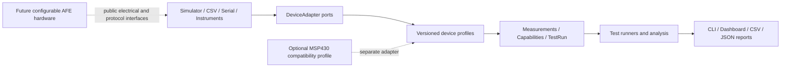

# Configurable Analog Front-End & Validation Platform

> **Analog Validation Studio** — a controller-neutral software and future low-voltage hardware platform for repeatable analog front-end characterization, automated test execution, and evidence-aware reporting.

| Project status | Current value |
|---|---|
| Development stage | Software Phase 1, Step 6 of 8 complete |
| Release maturity | Pre-MVP; core architecture and protocol foundation |
| Current package | `mixed-signal-afe-validation-platform 0.1.0.dev0` |
| Automated host tests | 224 passed |
| Formal package coverage | 100% of 899 statements |
| Highest evidence level | `HOST_TEST` |
| Verified hardware claims | **0 — hardware has not been built or bench-validated** |

[Detailed project status](docs/PROJECT_STATUS.md) · [Product plan](docs/PRODUCT_PLAN.md) · [Requirements traceability](docs/REQUIREMENTS_TRACEABILITY.md) · [Latest completed report](reports/software-phase1-step6.md)

## Product vision

The project is being developed as an independent, reusable product rather than an accessory for one microcontroller board. Its long-term goal is to combine:

- a configurable low-voltage analog front end;
- controller-neutral Python test automation;
- replaceable simulator, file-replay, serial-controller, and instrument adapters;
- DC sweep, gain, offset, saturation, hysteresis, calibration, and frequency-response workflows;
- provenance-aware data and reports that distinguish synthetic, simulated, and physical evidence.

The software-first plan allows the complete software product to mature without requiring school laboratory equipment. Physical hardware becomes a later adapter and device-under-test path rather than a dependency of the software architecture.

## What is implemented today

- Installable `src/analog_validation` Python package with a single version source.
- Stable validation, framing, CRC, capability, configuration, and protocol error families.
- Immutable Measurement, TestRun, safe-range, and DeviceCapabilities models.
- Explicit evidence sources and quality flags; synthetic data cannot silently become bench evidence.
- Single CRC-16/CCITT-FALSE implementation with fixed golden vectors.
- Strict printable-ASCII CSV framing with CRC and a 128-byte record limit.
- Versioned `AFE,1,...` profile for telemetry, commands, and multi-record capability exchange.
- AFE v1 mapping into controller-neutral Measurement and DeviceCapabilities models.
- Host-side command checks that distinguish unsupported capability from unsafe configuration.
- Reproducible pytest, coverage, Ruff, mypy, sdist, and wheel verification gates.

Not yet implemented: production adapters, complete Simulator/CSV replay, test runners, serial transport, CLI, dashboard, end-user report generation, firmware, or validated physical hardware.

## Architecture



The analysis and reporting layers must not depend on COM port names, board registers, SDK calls, or board-specific pin maps. A new controller should require a profile/adapter, not a rewrite of the core product.

## AFE v1 example

AFE v1 records use the common bounded framing and an explicit profile version:

```text
AFE,1,TEL,120,45120,0,500,2487,4974,1,0000,D312
AFE,1,CMD,5,SET,STIMULUS_MV,0,1650,AD30
AFE,1,CAP_REQ,77,00F6
```

Capability responses use a DEVICE record, one CHANNEL record per advertised channel, and an END record. This avoids exceeding the 128-byte framing limit as devices grow.

See [AFE v1 profile](docs/afe-v1-profile.md), [CRC and framing](docs/framing-and-crc.md), and [protocol reference](docs/protocol.md).

## Verification snapshot

The current results are host-software evidence only:

| Verification gate | Result |
|---|---|
| Full pytest suite | 224 passed |
| Formal package statement coverage | 100% of 899 statements |
| AFE v1 profile tests | 40 passed |
| Ruff | Passed |
| mypy | Passed |
| Step 6 external wheel install and AFE v1 round trip | Passed |
| Hardware bench tests | Not run |

Every completed software checkpoint has a report under [`reports/`](reports/). Test counts and claims are updated only after the corresponding command has actually run.

## Quick start

Requirements: Python 3.10 or later. The current verified development environment uses Python 3.12.

```powershell
python -m venv .venv
.\.venv\Scripts\python.exe -m pip install -e ".[dev]"
.\.venv\Scripts\python.exe -m pytest
.\.venv\Scripts\python.exe -c "import analog_validation; print(analog_validation.__version__)"
```

Minimal AFE v1 round trip:

```python
from analog_validation.protocol import AfeTelemetry, encode_afe_message, parse_afe_message

message = AfeTelemetry(
    seq=1,
    time_ms=100,
    channel=0,
    input_mv=500,
    output_mv=1000,
    gain_milli=2000,
    threshold=0,
    fault_flags=0,
)

record = encode_afe_message(message)
assert parse_afe_message(record) == message
```

## Roadmap

| Stage | Purpose | Status |
|---|---|---|
| Software Phase 0 | Product baseline, audit, requirements, architecture decisions | Complete |
| Software Phase 1 | Domain, protocol, configuration, and golden core | In progress — 6/8 steps |
| Software Phase 2 | DeviceAdapter, simulator, CSV replay, capability workflow | Planned |
| Software Phase 3 | Test runners, analysis, calibration, structured results | Planned |
| Software Phase 4 | Serial transport and independent controller profiles | Planned |
| Software Phase 5 | CLI, dashboard, and evidence-aware reports | Planned |
| Software Phase 6 | Packaging, CI, documentation, and v1.0 release | Planned |
| Hardware Phases 0–7 | Design freeze through PCB and MSP430 compatibility | Gated; not started |

The next checkpoint is Software Phase 1 Step 7: safe, versioned configuration models. See the [file-level Phase 1 plan](docs/SOFTWARE_PHASE_1_PLAN.md).

## Repository guide

```text
src/analog_validation/    installable controller-neutral product core
dashboard/                Phase 0 compatibility code being migrated
tools/                    synthetic data and developer utilities
tests/                    regression and formal-package tests
test-data/golden/         frozen compatibility vectors
docs/                     product, architecture, protocol, safety, and status
reports/                  executed validation records and evidence limits
simulation/               LTspice tasks and ideal-model evidence
hardware/                 deferred design and procurement planning
```

## Independence and integration boundary

This is an **independent personal engineering project**.

- The configurable AFE and Analog Validation Studio are the product.
- MSP430FR6989 support is a future compatibility profile, not the product identity or required controller.
- Other controllers can integrate through documented 3.3 V electrical interfaces and versioned public protocols.
- This repository is separate from the **OSU Lab Bench Monitor Senior Capstone** and does not contain or claim team capstone output.

## Safety and evidence policy

- Only low-voltage 0–3.3 V work is planned; mains experimentation is out of scope.
- Numeric ranges in software fixtures are examples, not validated hardware limits.
- `SYNTHETIC`, `SPICE_*`, and `HOST_TEST` evidence cannot support physical performance claims.
- Only documented `BENCH_*` records may support future hardware claims.
- No external output may be enabled until device capability, safe range, common ground, wiring, and shutdown behavior are confirmed.

See [assumptions requiring confirmation](ASSUMPTIONS.md), [test and evidence policy](docs/test-plan.md), and [risk register](docs/risk-register.md).

## Documentation

- [Beginner project guide](docs/BEGINNER_PROJECT_GUIDE.md)
- [Product plan and staged acceptance gates](docs/PRODUCT_PLAN.md)
- [Product architecture](docs/PRODUCT_ARCHITECTURE.md)
- [AFE v1 profile](docs/afe-v1-profile.md)
- [Capability and TestRun semantics](docs/capabilities-and-test-runs.md)
- [Theory calculations](docs/theory.md)
- [Development environment](docs/DEVELOPMENT_ENVIRONMENT.md)

## License

No open-source license has been selected. All rights are currently reserved by the project owner.
