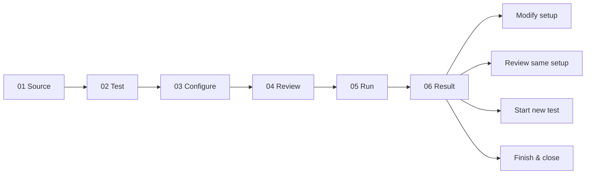

# 软件交互页面设计与验收指南

**适用对象：** 本地桌面工具、工程测试软件、配置向导、数据采集与分析界面<br>
**项目实例：** Analog Validation Studio 的 Tkinter/ttk Dashboard<br>
**证据范围：** 软件设计、`HOST_TEST`、`SYNTHETIC` 和人工界面验收；不构成硬件或正式无障碍认证

## 1. 指南目的

工程软件不仅要“能够执行”，还必须让用户知道当前发生了什么、将要发生什么、哪些数据
会被保留，以及哪些操作会接触文件或外部设备。本指南汇总本项目在界面设计、自动化测试
和人工验收中实际发现的问题，并把它们转化为可复用的设计规则。

本指南重点解决五类风险：

1. 用户走完流程后不知道怎样结束、保存或重新开始；
2. 页面可以显示，但关键状态因滚动、布局或刷新问题不可见；
3. 页面保留了旧授权、旧提示或旧路径，导致用户误操作；
4. 后台任务、连续运行或关闭窗口造成界面卡顿、竞态或资源未清理；
5. 软件结果被误解为硬件测量或产品认证。

## 2. 核心设计原则

### 2.1 让状态可见，而不是让用户猜测

界面始终应回答以下问题：

- 当前处于哪一步？
- 哪些输入已经检查？
- 当前是否允许运行？
- 后台任务是等待、运行、成功、失败、取消，还是尚未开始？
- 当前结果来自模拟器、回放文件、主机测试还是真实台架？
- 结果是否已经保存？保存到了哪里？
- 哪些内容尚未验证？

按钮变灰只能表达“现在不能点击”，不能替代原因说明。重要状态应同时使用文字、结构和
必要的视觉差异表达，不能只靠颜色。

### 2.2 把可逆操作和破坏性操作分开

返回上一步、修改配置、复核相同配置、开始新测试和关闭程序不是同一种操作：

- **Previous step / Modify setup**：保留用户已经输入的内容；
- **Review same setup**：复用同一配置，但重新建立一次明确的运行授权；
- **Start new test**：明确清空旧草稿和旧结果；
- **Finish & close**：结束会话，不应暗中开始新测试；
- 丢弃尚未保存的最终结果前必须确认，安全默认选项应为“不丢弃”。

“返回”不应成为隐式重置按钮。只有名称和提示都明确的重置动作才能清空数据。

### 2.3 在副作用发生前设置清晰边界

选择数据源不应自动读取文件、打开串口、创建输出或启动任务。推荐顺序是：

```text
选择和填写
    -> 本地字段验证
    -> 编译不可变请求
    -> 展示完整 Review
    -> 用户明确点击 Run
    -> 才获取资源并执行
    -> 清理资源后形成最终结果
```

涉及系统对话框、文件写入、端口枚举或设备访问的按钮，应使用具体动词。需要先让用户
补充信息的动作可使用省略号，例如 **Choose save location...**。

### 2.4 预防错误优先于事后解释

界面应在运行前拒绝：

- 空值、非数字和超出范围的数值；
- 相互矛盾的字段组合；
- 与所选测试无关却被误认为有效的输入；
- 缺列、非法单位或不完整的回放文件；
- 与所选格式不一致的文件扩展名；
- 会覆盖现有证据文件的保存目标。

错误发生后，至少显示：错误类别、发生了什么、可能原因和安全的下一步。正常用户模式
不应只显示 traceback 或内部异常名称。

### 2.5 界面负责表达，领域核心负责计算

Dashboard 不应自行实现 CRC、线性拟合、饱和区排除、迟滞阈值或 PASS/FAIL 判定。
它只负责收集意图、展示复核后的请求和呈现已经完成的结果。这样 CLI、Dashboard 和未来
第三方界面才能使用同一套工程逻辑，避免“同一数据在两个页面得到不同答案”。

## 3. 先定义状态，再绘制页面

### 3.1 建议的状态层级

一个测试型产品至少应区分以下对象：

| 状态对象 | 含义 | 能否直接运行 |
| --- | --- | --- |
| Draft | 用户正在编辑的字符串和选择 | 否 |
| Reviewed request | 已通过验证、边界明确的不可变请求 | 是 |
| Active job | 后台 worker 当前拥有的任务和资源 | 已在执行 |
| Finalized result | 清理结束后冻结的结果和证据 | 否；只能呈现或导出 |
| Saved artifact | 已成功写入新路径的结果副本 | 不适用 |

Draft 一旦被修改，旧的 Reviewed request 就必须失效。页面不能继续显示 `can_run=true`，
否则用户可能以为运行的是新配置，实际执行的却是旧配置。

### 3.2 线性流程与明确出口

本项目采用固定六步流程：



页面顶部应同时显示步骤名称和 `Step N of 6`。步骤指示器用于定位，Previous/Continue
按钮用于导航，两者不应混成一个难以理解的控件。

### 3.3 转换规则

- 从 Review 返回 Configure：保留输入，但撤销运行授权；
- 从 Result 选择 Modify：保留配置和可见结果作为参考，但修改后必须重新验证；
- 从 Result 选择 Review same setup：重新显示完全相同的边界并要求再次明确 Run；
- 选择 Start new test：清除旧结果、旧保存路径、旧问题和旧运行授权；
- 关闭窗口：若任务运行中，先请求协作式取消并完成有界清理；
- 任一可能丢失唯一未保存结果的转换：先显示确认对话框。

## 4. 页面布局、滚动与缩放

### 4.1 自适应滚动规则

滚动条不是固定装饰，而是内容溢出时才出现的导航能力：

- 页面内容未超过视口时，内容从顶部开始，滚轮不应把页面推入空白区域；
- 内容超过视口时，显示可操作的垂直滚动条，并响应滚轮；
- 切换步骤或标签页后，页面回到顶部，不继承上一页的旧滚动位置；
- 调整窗口大小、DPI 或字体后，重新计算内容高度和滚动范围；
- 滚动位置必须限制在合法范围，不能出现顶部或底部的大块空白；
- 表格自身需要滚动时，应明确区分表格滚动与整页滚动，避免事件相互争抢。

验收不能只检查“滚轮能动”。还要分别检查短页面不动、长页面能动、缩放后重新判断、
切页回到顶部，以及关键状态能否到达。

### 4.2 信息层级

推荐从上到下安排：

1. 产品名称和安全/运行模式；
2. 当前步骤与简短的 What / Why / Confirm；
3. 当前步骤需要的输入；
4. Review、问题和主要动作；
5. 运行状态；
6. 结果、证据、限制和导出。

把低频高级选项隐藏或分组，不要让初学者同时面对所有字段。与当前来源或测试无关的字段
应禁用或隐藏，并在附近说明它们为什么不可用。

### 4.3 首帧和重绘

桌面应用启动时出现黑块、未完成布局或反复闪烁，会让用户认为程序已经卡死。推荐：

- 根窗口在控件创建、主题应用、首次布局和 `update_idletasks()` 完成前保持隐藏；
- 首帧准备完成后一次性显示窗口；
- 后台轮询只更新发生变化的区域；
- 使用递增 revision 或不可变状态判断是否需要重绘；
- 不要每隔几十毫秒清空并重建整个结果表格；
- 长任务在 worker 中运行，所有 Tk 控件操作仍留在 UI owner thread。

真实 Windows 验收中未再观察到不完整黑色首帧，但这不能代替不同显卡、Remote Desktop
和显示缩放环境的后续测试。

## 5. 按钮、命名与视觉优先级

### 5.1 一个页面只突出一个主要动作

主要按钮应表示用户当前最合理的下一步，例如 Continue、Validate setup、Run reviewed
test 或 Save analysis result。返回、发现端口、关闭和重置属于次要动作，不应与主要动作
争夺相同视觉权重。

### 5.2 使用动作名称，不使用模糊名词

| 不推荐 | 推荐 | 原因 |
| --- | --- | --- |
| OK | Validate setup | 说明会执行什么 |
| Submit | Run reviewed test | 说明将启动任务 |
| Reset | Start new test | 说明数据会被清空 |
| Export | Choose save location... / Save analysis result | 区分选择路径与真正写入 |
| Back（并重置） | Previous step | 不暗示破坏性副作用 |

### 5.3 启用状态必须与真实权限一致

- 未完成 Review 时，Run 必须禁用；
- 修改 Reviewed request 后，Run 必须再次禁用；
- 没有可导出的分析 bundle 时，Save 必须禁用并说明原因；
- 运行中只能启用安全取消相关动作；
- disabled 控件不授予隐式文件、串口或硬件权限。

## 6. 输入、验证与错误恢复

### 6.1 输入字段要自描述

每个字段应尽可能同时给出：

- 名称；
- 单位；
- 合法范围；
- 是否必填；
- 与哪个来源或测试相关；
- 合并约束，例如 rising + falling 的总上限。

例如 `Samples / DC points` 不仅要拒绝 0，还应在标签或帮助文本中显示合法范围
`1–10000`，让用户在提交前就能发现问题。

### 6.2 验证顺序

1. 必填检查；
2. 类型转换；
3. 单字段范围；
4. 跨字段关系；
5. 来源能力和安全边界；
6. 文件结构或数据集完整性；
7. 生成不可变 Review。

任何一步失败都不得启动 worker 或获取外部资源。

### 6.3 错误展示

问题区域不能只在某个步骤显示。若错误在 Configure 发生，用户返回 Configure 后仍必须看见
它。推荐格式：

```text
ERROR [INVALID_REQUEST]
What happened: sample_count must be between 1 and 10000.
Possible cause: the value is missing, non-numeric, or outside the supported range.
Safe next step: correct the highlighted field and validate the setup again.
```

新的失败必须替换与它冲突的旧成功提示。例如重复保存被拒绝后，不能继续显示“保存成功”。

未来优化可为问题对象增加稳定的 `field_id`，让界面自动聚焦第一个非法字段，而不是解析
英文错误文本。

## 7. 保存、导出与未保存结果

### 7.1 不使用模糊的默认目录

分析结果可以先保留在内存中，但文件写入需要用户明确选择：

- Destination 初始为空；
- **Choose save location...** 打开操作系统原生保存对话框；
- 对话框建议与格式匹配的文件名；
- JSON 只显示 `.json`，CSV 只显示 `.csv`；
- 用户取消对话框时，原字段和值保持不变。

### 7.2 路径与格式一致

手动输入路径时，扩展名必须与格式一致。选择 JSON 却填写 `.csv` 应在写文件前失败，
并且不得创建部分文件。

### 7.3 默认不覆盖

工程证据采用 create-new 语义：

- 目标已存在时拒绝覆盖；
- 错误说明需要选择新路径；
- 原文件保持不变；
- 多文件报告使用临时 staging 和原子发布，避免半成品目录。

### 7.4 每个结果拥有独立保存状态

第二次运行完成后必须清空第一次结果的 Destination。否则用户可能无意中把新结果写到旧
位置。成功保存后应记录当前 finalized result 已有一个外部副本；新结果产生时重新变为
未保存状态。

修改、重新开始或关闭会丢弃唯一未保存结果时，应弹出确认，默认选择 No，并允许用户返回
Result 页面继续保存。

## 8. 后台任务、连续运行与安全关闭

### 8.1 单一资源所有者

一个 worker 在任一时刻只拥有一个 job 和它的 adapter/service。Widget 不直接打开、关闭
或操作数据源。这样可以明确谁负责清理资源，并避免两个按钮同时控制同一端口或文件。

### 8.2 不阻塞 UI 线程

- 长时间采集和分析在 worker 中执行；
- UI 线程只轮询有界、不可变的事件副本；
- 轮询本身不能触发全页无条件重绘；
- 事件队列必须有最大容量，并显示 dropped 数量；
- 完成、失败和取消都必须先完成 cleanup，再形成最终状态。

### 8.3 处理快速连续运行

人工验收曾发现：前一个任务的 terminal event 可能在新任务启动后才到达。推荐在替换 active
request 前先排空并核对旧 terminal queue，再为新任务分配新 revision/job identity。
结果、事件、保存状态和按钮状态都必须绑定到同一个 job identity，不能仅按“最近收到”显示。

### 8.4 Cancel 和 Close

- Cancel 是协作式请求，不应直接杀死线程并跳过清理；
- `CANCELLED` 不能生成 PASS 或可导出的完整结果；
- Close 在有活动任务时请求取消，并在有界时间内等待；
- 若无法安全结束，应告诉用户当前状态和安全下一步，不能假装已经关闭资源。

## 9. 结果、证据与声明边界

结果页至少分开显示：

| 字段 | 回答的问题 |
| --- | --- |
| Product status | 软件任务是否完成 |
| Engineering outcome | 工程准则是 PASS、FAIL、INCOMPLETE 还是无分析结论 |
| Evidence source | 数据来自哪里 |
| Hardware claim | 能否据此声称硬件已验证 |
| Limitations / Not verified | 当前结果不能证明什么 |
| Saved artifacts | 哪些结果文件已经真正写入 |

READ 可以 `COMPLETED`，同时没有工程 PASS/FAIL；这不是矛盾。Simulator 的分析可以 PASS，
但仍必须显示 `SYNTHETIC` 和 `NO_NEW_HARDWARE_VALIDATION`。Presentation 层只复制 finalized
result，不能在打开页面或导出时重新计算结论。

## 10. 键盘、可访问性与显示环境

最低基线：

- 所有可操作控件可以通过合理的 Tab 顺序到达；
- 焦点始终可见；
- 切换步骤后，焦点落在新页面的有效控件，而不是已禁用或隐藏的旧控件；
- 错误、状态和 PASS/FAIL 不只靠颜色表达；
- 常用缩放比例下标签不截断、按钮不重叠、关键内容可滚动到达；
- Enter、Space 和原生对话框行为符合平台习惯；
- 不添加没有界面提示和文档说明的隐藏快捷键。

本项目已经自动检查 Tk scaling 1.0、1.5 和 2.0 以及基本焦点遍历，但这不代表通过了
屏幕阅读器、WCAG、高对比度或所有显示环境认证。

## 11. 从实际缺陷提炼出的规则

| 实际现象 | 根本风险 | 必须提前设计的规则 |
| --- | --- | --- |
| 流程到 Result 后没有 Finish 或 Restart | 用户被困在终态 | 每个终态必须提供保存、修改、复核、新建和关闭出口 |
| Back 会重置数据 | 普通导航造成意外丢失 | Back 保留草稿；清空只能由明确的新建/重置动作完成 |
| 长页面没有滚动，Run status 看不到 | 关键状态不可达 | 以实际内容高度决定滚动范围，并人工检查所有关键区域 |
| 短页面仍可滚进大片空白 | 页面看似失控 | 内容未溢出时禁用滚动并固定在顶部 |
| 页面初次打开出现黑块或拼图式加载 | 用户误判卡死 | 隐藏构建、完成首帧后显示、避免轮询时整页重建 |
| 保存位置含义不清 | 用户不知道结果在哪里 | 不设隐式默认路径；提供原生 picker 和明确 Destination |
| JSON/CSV 扩展名与格式不一致 | 产物含义错误 | 写入前验证 suffix；picker 仅显示当前格式 |
| 新结果沿用旧保存路径 | 新证据可能写错位置 | 每个 finalized result 清空 destination 并拥有独立保存状态 |
| 未保存结果可直接关闭或重置 | 唯一结果意外丢失 | 破坏性转换前确认，默认 No |
| 错误只在 Review 页显示 | 用户看不到如何修复 | issue panel 跟随错误状态，而不是固定在某一步 |
| 保存失败后仍显示旧“成功” | 状态互相矛盾 | 新操作以事务方式替换该动作的旧状态消息 |
| Review 后返回编辑仍可直接 Run | 运行授权与输入不一致 | 修改草稿立即使 reviewed request 和 `can_run` 失效 |
| 快速重跑混入旧 terminal event | 结果归属错误 | 使用 job identity/revision，并在切换前协调旧队列 |
| 输入 0 后只显示泛化错误 | 用户无法快速定位 | 标签提前给范围，错误给出具体字段、合法值和下一步 |

## 12. 分层自动化测试策略

界面测试不应只依赖鼠标截图，也不应只测试底层函数。建议分层：

1. **状态模型单元测试**：每个 action 的状态转换、失效规则和保存状态；
2. **Presenter 测试**：文本、按钮权限、错误和证据标签是否由状态正确派生；
3. **Controller/Application 测试**：Review、Run、Cancel、export 和 cleanup 编排；
4. **Fake-toolkit widget 测试**：按钮 wiring、scrollbar 命令、平台滚轮事件和字段同步；
5. **真实 Tk smoke**：实际创建窗口、缩放、焦点、首帧和安全关闭；
6. **端到端链路**：Simulator/Replay 从输入到 Result/Export；
7. **压力与竞态测试**：快速连续运行、有界事件队列、重复刷新和取消；
8. **安装后测试**：从 wheel 在仓库外启动，而不是只验证源码目录；
9. **人工验收**：视觉层级、语义理解、系统 picker、异常恢复和主观流畅度。

自动化通过不能替代人工视觉验收；人工“看起来正常”也不能替代状态机、竞态和安装边界测试。

## 13. 人工验收用例

### A. 启动和布局

- 启动时不出现长期黑屏、未完成布局或反复闪烁；
- 默认页从顶部开始；
- 缩小窗口后才出现需要的滚动能力；
- 恢复大窗口后短页面回到顶部且滚轮不再移动；
- Run status、结果、限制和保存区域都能到达。

### B. 导航和状态

- Previous 保留已输入内容；
- Review 返回 Configure 后 Run 失效；
- Result 的四个后续动作语义互不混淆；
- Start new test 才真正清空表单和结果；
- 页面标题、步骤号和可用按钮始终一致。

### C. 输入和错误

- 分别输入空值、文本、0、上限和超上限；
- 错误在正确页面持续可见；
- 未通过验证时 worker 不启动；
- 修正后错误消失并可重新 Review；
- 非法 Replay 在 Run 前被拒绝。

### D. 运行、取消和重复运行

- 正常任务显示状态变化和最终结果；
- Cancel 后为 `CANCELLED`，无虚假 PASS；
- 连续运行两次不混入旧事件或旧结果；
- 关闭活动窗口会安全取消和清理；
- 完成后无残留窗口或后台任务。

### E. 保存和证据

- picker 的默认文件名和筛选格式正确；
- Cancel picker 不修改字段；
- suffix 不匹配时不创建文件；
- 已存在路径不被覆盖；
- 新结果的 Destination 为空；
- 未保存结果被丢弃前有安全确认；
- Result 同时显示 outcome、provenance、hardware claim 和 limitations。

### F. 键盘和缩放

- 只用键盘可以走完 Simulator 的必需流程；
- 焦点不进入隐藏或 disabled 控件；
- 100%、125%、150%、175% 和 200% 缩放下检查截断和重叠；
- 高对比度、Remote Desktop 和屏幕阅读器若未测试，明确记录 `NOT_RUN`，不能填写 PASS。

## 14. 页面 Definition of Done

一项界面功能只有同时满足以下条件才算完成：

- [ ] 已定义用户目标、前置条件、成功状态、失败状态和退出路径；
- [ ] 已列出文件、端口、设备、网络和数据丢失等副作用；
- [ ] 状态转换和运行授权有自动化测试；
- [ ] 短页和长页的滚动逻辑都通过；
- [ ] 输入范围、单位和跨字段约束在运行前验证；
- [ ] 错误包含 what、cause 和 safe next step；
- [ ] 未保存结果、覆盖和重置受到保护；
- [ ] 连续运行、取消、关闭和资源清理通过；
- [ ] 键盘焦点和常用缩放通过；
- [ ] 安装后的真实界面至少完成一次 smoke；
- [ ] 人工验收记录了预期、实际结果和未测试环境；
- [ ] 证据来源和未验证项清晰可见；
- [ ] 文档、截图和实现使用相同按钮名称与当前行为。

## 15. 应避免的反模式

- 用 disabled 按钮代替原因说明；
- 在 ComboBox 选择变化时自动打开文件或端口；
- 让 Back、Close 或切换标签页隐式清空数据；
- 每次轮询都销毁并重建整个页面；
- 把 worker thread 的回调直接写入 Tk widget；
- 在界面层复制一套工程计算；
- 把成功运行等同于工程 PASS；
- 把软件 PASS 等同于硬件验证；
- 默认覆盖旧输出；
- 只在开发源码目录测试，不验证安装后的程序；
- 只靠截图判断竞态、清理和结果归属；
- 因为某环境无法测试，就把 `NOT_RUN` 写成 PASS。

## 16. 已知后续改进

以下项目值得继续做，但不能根据当前证据声称已经完成：

- 为结构化问题增加 `field_id` 和首个非法字段聚焦；
- Windows 屏幕阅读器状态播报审计；
- 高对比度、125%/175% 缩放、小屏幕和 Remote Desktop 测试；
- 在稳定消息 ID 基础上评估本地化；
- 真实用户的长时间键盘操作研究；
- macOS/Linux GUI 行为与不同窗口系统验证；
- 在不降低可发现性的前提下评估可见快捷键。

## 17. 本项目证据与参考

项目内证据：

- [Dashboard interaction design audit](UX_DESIGN_AUDIT.md)
- [Local Dashboard design](dashboard.md)
- [Windows interaction QA](../reports/dashboard-ux-windows-qa-2026-09-02.md)
- [Private beta testing guide](USER_TESTING_GUIDE.md)
- [Product worker and cancellation](product-worker.md)
- [Result export safety](result-exports.md)

公共设计参考：

- Nielsen Norman Group, [10 Usability Heuristics for User Interface Design](https://www.nngroup.com/articles/ten-usability-heuristics/)
- U.S. Web Design System, [Step indicator](https://designsystem.digital.gov/components/step-indicator/)
- Microsoft Learn, [Commanding basics](https://learn.microsoft.com/en-us/windows/apps/design/basics/commanding-basics)
- Microsoft Learn, [Dialogs and flyouts](https://learn.microsoft.com/en-us/windows/apps/design/controls/dialogs-and-flyouts/)
- Microsoft Learn, [Keyboard interactions](https://learn.microsoft.com/en-us/windows/apps/develop/input/keyboard-interactions)
- Microsoft Learn, [Save files with a picker](https://learn.microsoft.com/en-us/windows/apps/develop/files/pickers-save-file)
- W3C WAI, [Understanding focus order](https://www.w3.org/WAI/WCAG22/Understanding/focus-order.html)
- W3C WAI, [Understanding error identification](https://www.w3.org/WAI/WCAG22/Understanding/error-identification)
- TkDocs, [Windows and dialogs](https://tkdocs.com/tutorial/windows.html)
- TkDocs, [Event loop](https://tkdocs.com/tutorial/eventloop.html)

这些参考用于建立可迁移的设计原则。本指南不声称 Analog Validation Studio 已获得 WCAG、
Windows、硬件安全或任何第三方认证。
