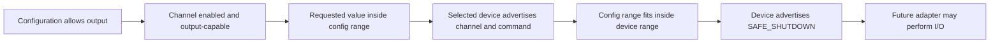

# Versioned Validation Configuration

Software Phase 1 Step 7 defines the first safe, controller-neutral configuration format for Analog Validation Studio. The format describes intent and safety limits; it does not connect to a device or perform an output operation.

## Why JSON is used

Configuration files are strict UTF-8 JSON. They are parsed as data and are never imported as Python modules or passed to `eval`, `exec`, a shell, or a template engine. This makes the file understandable to a beginner and prevents a configuration value from becoming executable code.

The parser rejects:

- duplicate, missing, and unknown fields;
- unknown enum values or units;
- `NaN`, positive infinity, and negative infinity;
- invalid UTF-8 and malformed JSON;
- non-`.json` files and files larger than 1 MiB;
- unsafe channel/range combinations and inconsistent timeouts.

## Read-only example

The repository includes [`examples/config/afe-synthetic-readonly.v1.json`](../examples/config/afe-synthetic-readonly.v1.json):

```json
{
  "schema_version": "validation-config.v1",
  "config_id": "afe-synthetic-readonly",
  "config_version": "1.0",
  "profile": {"name": "afe", "version": "1"},
  "evidence_source": "SYNTHETIC",
  "allow_output": false,
  "timeouts_s": {
    "connect": 5.0,
    "command": 2.0,
    "settle": 0.1,
    "test": 60.0
  },
  "channels": [
    {
      "name": "afe.ch0.input",
      "role": "ANALOG_INPUT",
      "unit": "mV",
      "enabled": true
    }
  ]
}
```

Load it without any hardware dependency:

```python
from analog_validation import load_validation_config

config = load_validation_config(
    "examples/config/afe-synthetic-readonly.v1.json"
)
assert config.allow_output is False
```

## Field meanings

| Field | Meaning |
|---|---|
| `schema_version` | Shape and interpretation of the JSON document; currently exactly `validation-config.v1` |
| `config_id` | Stable human-readable identity for this configuration |
| `config_version` | Revision of the user's test configuration |
| `profile` | Required public device profile name and version |
| `evidence_source` | Expected data provenance; a label alone never proves that bench work occurred |
| `allow_output` | First software permission gate; defaults to false in the model |
| `timeouts_s` | Finite connection, command, settling, and whole-test time limits in seconds |
| `channels` | Explicit names, roles, units, enabled state, and output limits |

Supported channel roles are `ANALOG_INPUT`, `ANALOG_OUTPUT`, `PWM_OUTPUT`, and `DIGITAL_INPUT`. Digital inputs must use `bool`; PWM outputs must use `ratio`. Every output channel must carry its own inclusive `safe_output_range` with a matching unit.

## Output safety is a sequence of gates



Step 7 implements gates A–F as host-side checks but does not implement G. A future adapter must call both configuration and capability validation before I/O. Physical wiring, common ground, supply rails, device polarity, shutdown behavior, and measured limits remain separate bench-verification gates.

## Timeout rule

- `connect`, `command`, and `test` must be greater than zero;
- `settle` may be zero but cannot be negative;
- `test` must be at least `command + settle`.

Timeouts prevent a future runner from waiting forever. They are not timing-accuracy claims about any controller or instrument.

## Versioning rule

Changing the meaning or required shape of public fields requires a new schema version and migration notes. Editing `config_version` identifies the user's configuration revision; it does not change the JSON schema.

## Current evidence boundary

The format and validation logic are verified by host tests. No serial port was opened, no device was selected, no output was generated, and no hardware voltage range was verified in Step 7.
