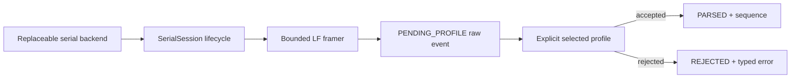

# Driver-Neutral Serial Transport and Raw-Event Boundary

Software Phase 4 Step 3 defines how Analog Validation Studio will control a
serial connection without coupling the product core to pyserial, Windows COM
APIs, one controller, or one wire protocol. The implementation is host-tested
with a deterministic in-memory backend. It has not opened a physical port or
validated UART hardware.

## Why this layer exists

A serial driver does not normally return one complete protocol message per
read. One message can arrive in several chunks, several messages can arrive in
one chunk, a read can time out normally, and a cable can disconnect while a
partial message is buffered. Mixing those conditions directly into AFE or
MSP430 field parsing would make every future profile repeat fragile lifecycle
code.

Step 3 separates five responsibilities:

- `SerialBackend` owns only discovery, open, bounded read, and close calls.
- `SerialSession` owns legal states, timeouts, disconnect cleanup, finite
  reconnect attempts, and deterministic logical closure.
- `BoundedLineFramer` turns arbitrary chunks into complete LF-delimited bytes.
- `BoundedRawEventLog` retains bounded receive provenance in memory.
- the independent Step 4 AFE and Step 5 MSP430 profiles own device fields, versions, CRC interpretation,
  capabilities, Measurements, and sequence widths.

Receiving bytes is therefore not the same as understanding or validating them.

## Lifecycle contract

`SerialSession` has only two logical states: `CLOSED` and `OPEN`.

| Operation | Allowed state | Result |
|---|---|---|
| discover | `CLOSED` | validated, unique `SerialPortInfo` tuple |
| open | `CLOSED` | exact immutable settings passed to backend |
| poll | `OPEN` | `DATA`, `TIMEOUT`, or `RECONNECTED` |
| close | either | idempotent logical `CLOSED` and cleared partial state |

Important behavior:

- `TIMEOUT` and a zero-byte read mean no data arrived during this bounded poll;
  they are not protocol failures and do not discard an existing partial frame.
- ordinary backend/receive failures close the logical session and clear the
  incomplete frame before raising a typed product error.
- disconnect clears the incomplete frame, closes the old backend resource, and
  makes at most the configured reconnect attempts for that incident.
- a successful reconnect returns before reading again. This makes every public
  call finite and prevents old and new connection bytes from being combined.
- close failure raises `SerialCloseError`, but logical state and buffered bytes
  are still deterministically closed/cleared.
- the session is designed for one owning worker. The raw-event log itself uses a
  lock so snapshots and outcome updates do not expose a mutable internal deque.

## Connection settings and hard bounds

`SerialConnectionSettings` requires an explicit `port_id` and `profile_name`.
It never guesses a profile from a board name, COM number, USB identity, or
driver description.

| Setting | Default | Accepted bound |
|---|---:|---:|
| baud rate | 115,200 | 1–4,000,000 |
| data bits | 8 | 5–8 |
| parity | none | none/even/odd |
| stop bits | 1 | 1/1.5/2 |
| bytes per read | 512 | 1–65,536 |
| complete record size | 128 bytes | 1–4,096 bytes |
| read timeout | 0.25 s | greater than 0 through 60 s |
| reconnect attempts | 2 | 0–10 per disconnect incident |

The backend contract must return no more than the requested read size. An
overlong logical record is discarded through the next LF and reported as a
`StreamIssue`; the rejected overlong bytes are not copied into the raw-event
log, because retaining them would defeat the memory bound.

## Raw-record event model

Every complete bounded record is initially logged with:

- a monotonic local event ID;
- timezone-aware receive time normalized to UTC;
- logical port identity and explicitly selected profile;
- the exact received bytes, including the line terminator;
- status `PENDING_PROFILE` and no inferred business meaning.

A selected profile must explicitly finish the event as one of:

| Status | Required outcome | Forbidden meaning |
|---|---|---|
| `PENDING_PROFILE` | raw receive provenance only | no parse result, error, or sequence |
| `PARSED` | bounded parse summary; optional typed sequence observation | no error fields |
| `REJECTED` | bounded error type and safe single-line message | no parse result or sequence advance |

Events are immutable. `mark_parsed()` and `mark_rejected()` replace the retained
pending value, so code holding the original receive record cannot observe a
silent mutation. A missing or already-evicted ID is rejected instead of being
attached to the wrong new record.

## Resource and privacy policy

The default raw log retains at most 1,024 events and 256 KiB of raw bytes. Hard
configuration ceilings are 10,000 events, 2 MiB total raw bytes, and 4,096
bytes per event. When a count or total-byte limit is reached, the oldest whole
events are evicted and cumulative dropped-event/dropped-byte counters remain in
the snapshot.

Raw serial records can contain device identifiers, configuration, operational
state, or fault information. This Step 3 log:

- exists only in process memory;
- has explicit count, byte, and metadata-length limits;
- never writes to disk or uploads automatically;
- retains only the logical port ID in each raw event, not a USB serial number;
- requires a future explicit export action and evidence/privacy review before
  persistence can be added.

Calling `clear()` returns the previous immutable snapshot, clears retained data
and eviction counters, and keeps event IDs monotonic to prevent stale-ID reuse.

## Error boundary

Transport errors are exported from `analog_validation.transport` and remain
subclasses of the product-wide `AnalogValidationError`:

- `SerialStateError` for an illegal lifecycle call or invalid settings;
- `SerialDiscoveryError`, `SerialOpenError`, `SerialReadError`, and
  `SerialCloseError` for normalized backend boundaries;
- `SerialReconnectError` after the finite retry budget is exhausted;
- `SerialBackendTimeout` and `SerialBackendDisconnected` as backend-to-session
  control signals;
- `RawEventError`, `RawEventLimitError`, and `RawEventNotFound` for bounded log
  validation and updates.

Unexpected third-party driver messages are retained through Python exception
chaining but are not copied into raw-event error text automatically. A future UI
can therefore show a stable product message while developer diagnostics retain
the original cause.

## Replaceable backend rule

The formal package defines the `SerialBackend` port but deliberately ships no
OS driver implementation in Step 3. The test suite supplies
`tests.support.MemorySerialBackend`, which can script data, timeouts,
disconnects, and failures without hardware or sleeping.

A later OS adapter may use pyserial as an optional installation extra. Core
imports, simulation, replay, analysis, and report reading must continue to work
without pyserial, a serial driver, or a COM port. A future controller can reuse
this transport by implementing a separate profile; it must not add its business
fields to the session or framer.

## Current evidence boundary

HOST_TEST evidence covers partial/coalesced reads, timeout, open/read/close
failure, disconnect/reset, finite reconnect, overlong recovery, event eviction,
parse/reject transitions, CRC-envelope composition, package construction, and
external installed-package use.

It does not establish:

- OS port enumeration, permissions, driver behavior, or timing;
- pyserial compatibility or a real COM-port lifecycle;
- UART baud accuracy, voltage level, grounding, EMI, cable, or board behavior;
- an MSP430 business profile or a physically verified AFE profile;
- any physical measurement or hardware performance.

AFE and MSP430 profiles remain independent Steps 4 and 5. The AFE profile now
implements this boundary under HOST_TEST; the MSP profile remains Step 5. Their
compatibility is a public-interface integration between peer products, not a
repository merge or transfer of evidence.
